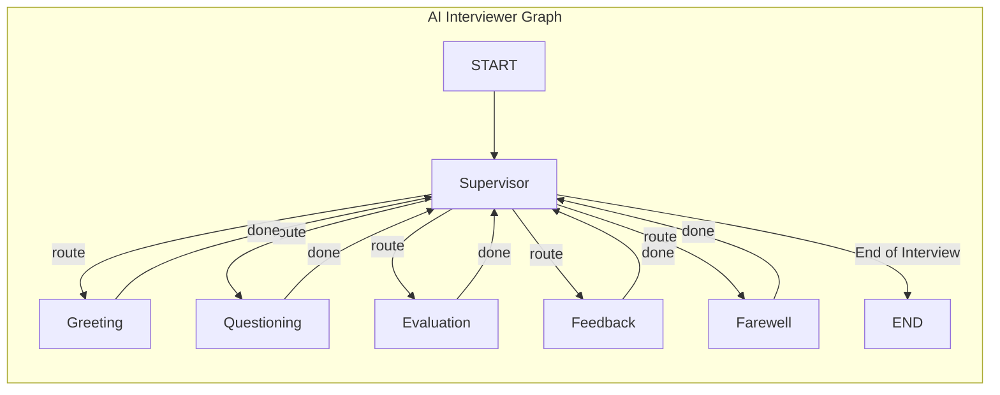

# LangGraph 기반 AI 면접관 챗봇 아키텍처 설계

## 1. 개요

본 문서는 `docs/research/1_복잡한_상호작용_챗봇_구현_연구.md` 기술 백서에 제시된 원칙과 패턴을 기반으로, AI 기술 면접관 챗봇의 LangGraph 아키텍처를 설계하는 것을 목표로 합니다.

이 아키텍처는 면접이라는 복잡한 상호작용을 모델링하고, 동적인 대화 흐름을 제어하며, 향후 새로운 기능(예: 다른 직무 면접, 코딩 테스트)을 쉽게 추가할 수 있도록 **모듈성, 확장성, 유연성**을 확보하는 데 중점을 둡니다.

## 2. 핵심 설계 원칙 (LangGraph 기본 원리)

백서에서 강조하는 LangGraph의 핵심 개념을 채택하여 아키텍처의 기반으로 삼습니다.

-   **StateGraph**: 상태를 가진 순환 그래프(Stateful, Cyclical Graph)를 사용하여, 면접관이 질문하고, 답변을 평가하고, 피드백을 주고, 다시 다음 질문으로 넘어가는 반복적이고 복잡한 면접의 흐름을 모델링합니다.
-   **상태 (State)**: Python의 `TypedDict`를 사용하여 면접의 전체 맥락을 관리하는 중앙 데이터 구조(`State`)를 명시적으로 정의합니다. 이 상태 객체는 대화 기록, 현재 면접 단계, 질문 목록, 사용자 답변, 평가 결과 등 모든 정보를 포함하는 "단일 진실 공급원(Single Source of Truth)" 역할을 합니다.
-   **노드 (Nodes)**: 면접 과정에서 필요한 각 기능(예: `면접 시작 안내`, `질문 선택`, `답변 평가`, `피드백 제공`)을 개별 Python 함수 또는 LangChain 실행 가능 객체(Runnable)로 구현하여 그래프의 노드로 정의합니다. 각 노드는 독립적으로 테스트하고 수정할 수 있어 모듈성을 높입니다.
-   **엣지 (Edges)**: 노드 간의 제어 흐름을 정의합니다. 특히 **조건부 엣지(Conditional Edges)**를 적극적으로 활용하여, 면접관의 동적인 의사결정(예: "사용자 답변의 평가 결과에 따라 다음 질문 난이도를 조절할지, 아니면 추가 질문을 할지 결정")을 구현합니다.

## 3. 제안 아키텍처: Supervisor-Worker 패턴

백서에서 제안된 가장 일반적이고 강력한 멀티 에이전트 패턴인 **Supervisor-Worker 아키텍처**를 채택합니다. 단일 에이전트에게 모든 역할을 부여할 경우 LLM의 추론 성능이 저하될 수 있으므로, 역할을 분리하여 시스템의 안정성과 효율성을 높입니다.

-   **Supervisor (면접 총괄 에이전트)**: 면접의 전체 흐름을 지휘하는 오케스트레이터입니다. 사용자의 입력과 현재 대화 상태를 종합적으로 분석하여, 다음에 어떤 작업을 수행해야 할지 결정하고 가장 적합한 **Worker 에이전트**에게 작업을 위임하는 역할을 합니다.
-   **Worker (전문가 에이전트)**: 각자 좁은 범위의 명확한 임무를 수행하는 데 특화된 에이전트들입니다. 이들은 감독자의 지시를 받아 실제 작업을 처리합니다.

### 3.1. 전문가 에이전트 (Workers) 구성

AI 면접관을 위해 다음과 같은 Worker 에이전트를 정의합니다.

-   `greeting_agent`: 면접을 시작하며 사용자에게 면접 과정에 대해 안내합니다.
-   `questioning_agent`: 면접 질문 목록과 사용자의 이전 답변 기록을 바탕으로, 다음에 제시할 가장 적절한 질문을 선택하고 사용자에게 묻습니다.
-   `evaluation_agent`: 사용자의 답변을 면접 질문의 의도와 평가 기준에 따라 분석하고 채점합니다.
-   `feedback_agent`: `evaluation_agent`의 평가 결과를 바탕으로, 사용자에게 구체적이고 건설적인 피드백을 생성하여 전달합니다.
-   `farewell_agent`: 모든 면접 절차가 끝났을 때, 마무리 인사를 하고 면접을 종료합니다.

### 3.2. 통합 상태 (State) 아키텍처

AI 면접관 챗봇의 모든 기능(페르소나, 안전장치, 선제적 대화, 평가 등)을 지원하기 위해, 연구 문서들의 요구사항을 종합하여 설계된 모듈식 상태 객체를 사용합니다. 이는 `docs/chatbot/2_chatbot_state_design.md`에 상세히 정의되어 있으며, 본 문서에서는 최상위 구조만 기술합니다.

```typescript
import { BaseMessage } from "@langchain/core/messages";
// 상세 하위 상태(UserContext, TaskState 등)는
// `docs/chatbot/2_chatbot_state_design.md`에 정의되어 있습니다.
import {
  UserContext,
  PersonaState,
  GuardrailState,
  ProactiveContext,
  FlowControlState,
  TaskState,
  EvaluationState,
} from "./sub_states"; // 가정된 경로

/**
 * AI 면접관 챗봇의 모든 상태를 포괄하는 최상위 통합 상태 인터페이스입니다.
 * 각 필드는 기능별로 모듈화된 하위 상태 객체를 나타냅니다.
 */
export interface InterviewState {
  // 1. 핵심 대화 상태
  user_context: UserContext;
  messages: BaseMessage[];

  // 2. 페르소나 상태
  persona: PersonaState;

  // 3. 가드레일 및 안전 상태
  guardrails?: GuardrailState;

  // 4. 선제적 대화 상태
  proactive?: ProactiveContext;

  // 5. 제어 흐름 상태
  flow_control: FlowControlState;

  // 6. 면접 과업 상태
  task: TaskState;

  // 7. 평가 및 메타데이터 상태
  evaluation: EvaluationState;
}
```

## 4. 그래프 구조 및 상호작용 흐름

### 4.1. 그래프 다이어그램 (Mermaid)

Supervisor-Worker 패턴의 제어 흐름을 시각화하면 다음과 같습니다. 모든 Worker는 작업을 완료한 후 항상 Supervisor에게 제어를 반환하여 다음 단계를 지시받습니다.



### 4.2. 상호작용 시나리오 예시

1.  **면접 시작**:
    -   사용자가 입장을 알리면, `START`에서 `Supervisor` 노드가 호출됩니다.
    -   `Supervisor`는 `interview_stage`가 초기 상태임을 인지하고, `next_worker_to_call`을 `greeting_agent`로 설정합니다.
    -   조건부 엣지에 의해 `Greeting` 노드가 실행되어 사용자에게 인사와 안내를 건넵니다.
    -   `Greeting` 노드는 작업 완료 후 제어를 `Supervisor`에게 돌려줍니다.

2.  **질문-답변-평가-피드백 루프**:
    -   `Supervisor`는 인사 단계가 끝났다고 판단하고, `next_worker_to_call`을 `questioning_agent`로 설정합니다.
    -   `Questioning` 노드는 질문 목록에서 다음 질문을 선택하여 사용자에게 제시합니다.
    -   사용자가 답변을 입력하면, 제어는 다시 `Supervisor`에게 돌아옵니다.
    -   `Supervisor`는 답변이 들어왔음을 확인하고, `next_worker_to_call`을 `evaluation_agent`로 설정합니다.
    -   `Evaluation` 노드는 답변을 평가하고, 결과를 `last_evaluation` 상태에 저장합니다.
    -   `Supervisor`는 평가가 완료되었음을 보고받고 `feedback_agent`를 호출합니다.
    -   `Feedback` 노드는 평가 결과를 바탕으로 사용자에게 피드백을 제공합니다.
    -   이 루프는 모든 질문이 소진될 때까지 `Supervisor`의 지휘 아래 반복됩니다.

3.  **면접 종료**:
    -   `Supervisor`는 `question_pool`이 비었음을 확인하고, `next_worker_to_call`을 `farewell_agent`로 설정합니다.
    -   `Farewell` 노드가 실행되어 마무리 인사를 합니다.
    -   마지막으로 `Supervisor`는 `FINISH`를 반환하여 그래프 실행을 `END`에서 종료시킵니다.

## 5. 고급 기능 통합 계획

백서에서 논의된 고급 패턴들을 적용하여 챗봇의 성능을 극대화합니다.

-   **에이전틱 RAG (Agentic RAG)**: `questioning_agent`는 단순한 질문 선택기를 넘어, 사용자의 이전 답변, 기술 스택 등을 동적으로 분석하여 질문을 변형(rewrite)하거나, 관련성이 낮은 질문은 건너뛰는 등 지능적인 검색 및 선택 로직을 구현합니다. 이는 백서의 '에이전틱 RAG' 청사진에 해당합니다.
-   **대화 메모리 (Conversation Memory)**: LangGraph의 내장 **체크포인터(Checkpointer)** 기능을 활용하여 전체 면접 대화의 `InterviewState`를 지속적으로 저장하고 불러옵니다. `thread_id`를 각 면접 세션에 부여함으로써, 사용자가 중간에 나갔다가 다시 돌아와도 면접을 이어서 진행할 수 있는 컨텍스트 유지를 구현합니다.
-   **오류 처리 및 복원력 (Error Handling & Resilience)**: 각 Worker 노드(특히 외부 API 호출이 있을 수 있는 경우) 내에 `try...except` 블록을 추가합니다. 실패 시, 상태에 `error` 플래그와 `error_count`를 기록하고, `Supervisor`는 이 상태를 바탕으로 재시도를 지시하거나, 사용자에게 문제를 알리는 등의 대체(Fallback) 전략을 수행하도록 설계하여 시스템 안정성을 높입니다.

## 6. 결론

본 문서에서 제안된 **Supervisor-Worker 아키텍처**는 `1_복잡한_상호작용_챗봇_구현_연구.md` 백서의 핵심 원칙들을 충실히 반영한 설계안입니다. 이 구조는 복잡한 AI 면접 시나리오를 효과적으로 관리할 수 있는 **제어력**과 **유연성**을 제공합니다. 각 Worker 에이전트의 모듈식 설계 덕분에, 향후 `코딩 테스트 채점 에이전트`나 `문화 적합성(Culture-fit) 질문 에이전트`와 같은 새로운 기능을 기존 시스템에 큰 영향을 주지 않고 손쉽게 통합할 수 있는 **확장성**을 보장합니다.
