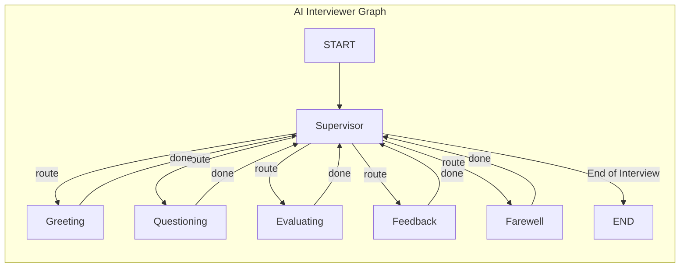

# LangGraph 기반 AI 면접관 챗봇 아키텍처 설계

## 1. 개요

본 문서는 `docs/research/1_복잡한_상호작용_챗봇_구현_연구.md` 기술 백서에 제시된 원칙과 패턴을 기반으로, AI 기술 면접관 챗봇의 구체적인 LangGraph 아키텍처를 설계하는 것을 목표로 합니다.

이 아키텍처는 면접이라는 복잡한 상호작용을 체계적으로 모델링하고, 동적인 대화 흐름을 제어하며, 향후 새로운 기능을 쉽게 추가할 수 있도록 모듈성, 확장성, 유연성을 확보하는 데 중점을 둡니다.

## 2. 제안 아키텍처: 5-Worker 면접관 에이전트 팀

기술 백서에서 제안된 가장 일반적이고 강력한 멀티 에이전트 패턴인 Supervisor-Worker 아키텍처를 채택합니다. 단일 에이전트에게 모든 역할을 부여할 경우 LLM의 추론 성능이 저하될 수 있으므로, 면접의 각 단계를 전담하는 5개의 전문가 에이전트(Worker)로 역할을 분리하여 시스템의 안정성과 효율성을 높입니다.

-   Supervisor (면접 총괄 에이전트): 면접의 전체 흐름을 지휘하는 오케스트레이터입니다. 사용자의 입력과 현재 대화 상태를 종합적으로 분석하여, 다음에 어떤 작업을 수행해야 할지 결정하고 가장 적합한 Worker 에이전트에게 작업을 위임하는 역할을 합니다. `docs/design/chatbot/3_chatbot_prompts_design.md`에 정의된 라우팅 규칙에 따라 의사를 결정합니다.

-   Worker (전문가 에이전트): 각자 좁은 범위의 명확한 임무를 수행하는 데 특화된 에이전트들입니다. 이들은 감독자의 지시를 받아 실제 작업을 처리합니다.

### 전문가 에이전트 (Workers) 구성

AI 면접관을 위해 다음과 같은 5개의 Worker 에이전트를 정의합니다. 이는 면접의 전체 생애주기(시작-질문-평가-피드백-종료)를 포괄합니다.

1.  `greeting_agent`: 사용자를 환영하고 면접 프로세스를 안내하며, 심리적 안정감을 제공하는 역할을 담당합니다.
2.  `questioning_agent`: 사용자의 기술 스택, 이전 답변 평가 결과, 현재 면접 난이도(`current_difficulty`)를 종합적으로 분석하여, `question_pool`에서 가장 적절한 다음 질문을 선택하고 제시합니다. 이 에이전트는 동적 난이도 조절(Dynamic Difficulty Adjustment)의 핵심 로직을 수행합니다.
3.  `evaluation_agent`: 사용자의 답변을 사전 정의된 평가 기준표(Rubric)에 따라 객관적으로 분석하고, 구조화된 평가 결과를 생성합니다.
4.  `feedback_agent`: `evaluation_agent`의 평가 결과를 바탕으로, 사용자가 이해하기 쉬운 형태의 건설적인 피드백을 생성하여 전달합니다. 강점을 먼저 강조하고 개선점을 제안하는 교육적인 접근을 취합니다.
5.  `farewell_agent`: 모든 면접 절차가 완료되었을 때, 사용자에게 감사를 표하고 긍정적으로 면접을 마무리하는 역할을 합니다.

## 3. 그래프 구조 및 상호작용 흐름

### 3.1. 그래프 다이어그램 (Mermaid)

Supervisor-Worker 패턴의 제어 흐름을 시각화하면 다음과 같습니다. 모든 Worker는 작업을 완료한 후 항상 Supervisor에게 제어를 반환하여 다음 단계를 지시받습니다.

### 3.2. 상호작용 시나리오 예시: 하나의 질문-답변 사이클

1.  면접 시작 및 첫 질문:
    -   (사용자 입력) → `START` → `Supervisor` 호출.
    -   `Supervisor`는 `task.interview_stage`가 초기 상태이므로 `Greeting` 에이전트로 라우팅.
    -   `Greeting` 에이전트가 환영 인사를 생성. → `Supervisor`로 제어 반환.
    -   `Supervisor`는 환영 인사가 끝났으므로 `Questioning` 에이전트로 라우팅.
    -   `Questioning` 에이전트가 첫 기술 질문을 생성하여 사용자에게 제시. → `Supervisor`로 제어 반환.
    -   `Supervisor`는 AI가 질문을 했으므로 사용자 답변을 기다리기 위해 `FINISH`를 반환, 그래프 실행 일시 중단.

2.  답변 평가 및 피드백 루프:
    -   (사용자 답변 입력) → `Supervisor` 재호출.
    -   `Supervisor`는 사용자가 답변했으므로 `Evaluating` 에이전트로 라우팅.
    -   `Evaluating` 에이전트가 답변을 평가하여 구조화된 결과를 상태에 저장. → `Supervisor`로 제어 반환.
    -   `Supervisor`는 평가가 완료됐으므로 `Feedback` 에이전트로 라우팅.
    -   `Feedback` 에이전트가 평가 결과를 바탕으로 사용자에게 피드백 제공. → `Supervisor`로 제어 반환.

3.  다음 질문 또는 종료:
    -   `Supervisor`는 피드백이 완료된 후, 남은 질문이 있는지(`question_pool`) 확인.
    -   남은 질문이 있다면, 다시 `Questioning` 에이전트를 호출하여 다음 질문 사이클 시작. 이 때 `questioning_agent`는 최근 평가 결과에 따라 상태의 `current_difficulty`를 조정한 후, 그에 맞는 질문을 선택합니다.
    -   모든 질문이 소진되었다면, `Farewell` 에이전트를 호출하여 면접 종료 절차 시작.

## 4. 고급 기능 통합 계획

기술 백서에서 논의된 고급 패턴들을 적용하여 챗봇의 성능을 극대화합니다.

-   동적 난이도 조절 (Dynamic Difficulty Adjustment, DDA): `questioning_agent`는 `evaluation_agent`의 평가 결과(`last_evaluation.overall_score`, 1-5점)를 기반으로 면접의 `current_difficulty` 상태(0-100)를 동적으로 조정합니다. 예를 들어, 최고점(5점)을 받으면 난이도를 +10점, 최하점(1점)을 받으면 -10점과 같이 미세 조정합니다. 이를 통해 사용자에게 너무 쉽거나 어렵지 않은, 개인화된 면접 경험을 제공합니다.
-   에이전틱 RAG (Agentic RAG): `questioning_agent`는 질문 데이터베이스에서 단순 검색하는 것이 아니라, 사용자의 답변 히스토리, 기술 트렌드, 난이도 곡선을 종합적으로 분석하여 동적으로 질문을 생성하거나 변형합니다.
-   대화 메모리 (Conversation Memory): LangGraph의 내장 체크포인터(Checkpointer) 기능을 활용하여 전체 면접 대화의 상태를 지속적으로 저장하고 불러옵니다. `thread_id`를 각 면접 세션에 부여함으로써, 사용자가 중간에 나갔다가 다시 돌아와도 면접을 이어서 진행할 수 있는 컨텍스트 유지를 구현합니다.
-   오류 처리 및 복원력 (Error Handling & Resilience): 각 Worker 노드(특히 외부 API 호출이 있을 수 있는 경우) 내에 `try...catch` 블록을 추가합니다. 실패 시, 상태에 `error` 플래그와 `error_count`를 기록하고, `Supervisor`는 이 상태를 바탕으로 재시도를 지시하거나, 사용자에게 문제를 알리는 등의 대체(Fallback) 전략을 수행하도록 설계하여 시스템 안정성을 높입니다.

## 5. 결론

본 문서에서 제안된 **5-Worker Supervisor 아키텍처**는 `1_복잡한_상호작용_챗봇_구현_연구.md` 백서의 핵심 원칙들을 충실히 반영하면서도, 기술 면접의 전체 라이프사이클을 포괄하는 구체적이고 효율적인 설계안입니다.

이 구조는 Supervisor의 지능적인 흐름 제어 하에서 5개의 전문화된 에이전트가 협력하여, 환영, 질문, 평가, 피드백, 마무리에 이르는 체계적인 기술 면접을 진행할 수 있도록 설계되었습니다. 각 에이전트의 명확한 역할 분담은 면접의 품질과 일관성을 높이면서도, 향후 새로운 질문 유형(예: 인성 면접, 코딩 테스트)이나 평가 방식을 독립적인 Worker로 쉽게 추가할 수 있는 높은 확장성을 보장합니다.
