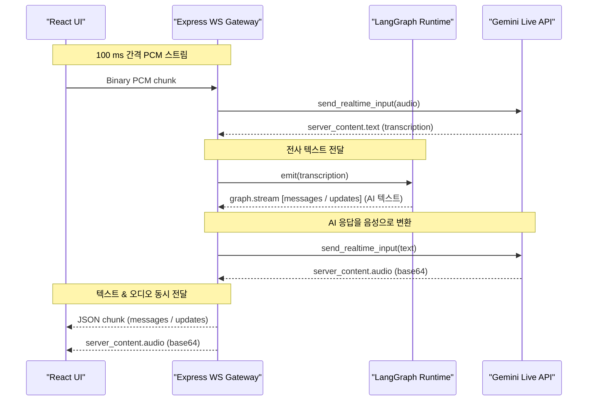

# Gemini Live API × LangGraph (TypeScript) 통합 가이드

이 문서는 TypeScript 기반 스택(Express + LangGraph + React)에서 Gemini Live API(실시간 WebSocket)를 LangGraph 상태 그래프와 연결하는 설계/코드 패턴을 요약한다. 자세한 배경과 레퍼런스는 `20_Gemini API LangGraph 통합_.md` 를 참고한다.

---

## 1. 통합 시나리오




```
┌───────────┐  WebSocket  ┌───────────────────────┐  Method call   ┌────────────────────┐
│ React UI  │────────────▶│  Express WS Gateway   │───────────────▶│ LangGraph Runtime  │
│ (MediaRec)|             │  LiveApiProxyService  │   emit/event   │  (LiveApiNode)     │
└───────────┘             └───────────────────────┘                └────────────────────┘
```

1. React: MediaRecorder가 PCM 스트림을 캡처하여 `/ws/live` 소켓으로 전송.
2. Express WS Gateway: 클라이언트-당 Gemini Live 세션을 생성(`ai.live.connect`)하고, 수신 이벤트를 LangGraph로 forward.
3. LangGraph: 커스텀 `LiveApiNode` 가 세션 상태를 보존하며 이벤트를 AgentState에 반영, 조건부 엣지를 통해 Tool 호출·응답 루트 결정.

---

## 2. LiveApiNode 구현 (TypeScript)

---

## 개발자가 반드시 확인해야 할 체크포인트

- 인증 보안
  - API 키를 절대 프런트에 노출하지 않는다. 서버-서버 프록시 또는 임시 토큰 사용.
  - .env 관리, git ignore 필수.
- 오디오 포맷
  - 입력: 16-bit PCM 16 kHz 모노
  - 출력: 24 kHz PCM. Web Audio 재생 시 샘플레이트 변환 필요.
- 지연 시간 튜닝
  - MediaRecorder 전송 주기: 50-100 ms 권장. 너무 짧으면 네트워크 오버헤드, 너무 길면 VAD 지연.
  - `bufferedAmount` 체크 후 back-pressure 적용.
- 모델 선택
  - 프로덕션 도구 호출 중심: gemini-live-2.5-flash (half-cascade).
  - 자연스러운 음성 대화 중시: gemini-2.5-flash-preview-native-audio-*
- 세션 수명
  - 최대 1 시간. 장기 대화는 주기적 갱신 or 재접속 로직 추가.
- 중단(바지-인) 대응
  - ActivityStart 이벤트 수신 시 현재 응답 취소, 새로운 사용자 입력으로 그래프 재라우팅.
- 안전 필터
  - finishReason SAFETY 발생 시 우아한 오류 처리 및 사용자 안내.
- 체크포인터 저장소
  - MemorySaver → RedisSaver 전환 시 싱글 톤 주의, 동일 thread_id 사용.
- 툴콜 안정성
  - 네이티브 오디오 모델은 도구 호출 정확도가 떨어질 수 있음. 필요 시 half-cascade로 전환.
- WebSocket 오류 처리
  - 1006, 1011 에러 코드 분기. 재시도 지수 백오프.


```ts
// liveApiNode.ts
import { NodeInterface, StateField } from "@langchain/langgraph";
import { GoogleGenAI, LiveSession } from "@google/genai";

interface LiveState {
  @StateField() liveEvents: any[];
  @StateField() toolCalls: any[];
  @StateField() interrupted: boolean;
  @StateField() sessionId: string;
}

export class LiveApiNode implements NodeInterface<LiveState, LiveState> {
  private session?: LiveSession;
  private readonly apiKey = process.env.GEMINI_API_KEY!;

  async invoke(state: LiveState): Promise<LiveState> {
    // 세션이 없으면 생성 (초기 실행)
    if (!this.session) {
      const ai = new GoogleGenAI({ apiKey: this.apiKey });
      this.session = await ai.live.connect({
        model: "gemini-live-2.5-flash",
        config: {
          response_modalities: ["audio", "text"],
          input_audio_transcription: {},
          output_audio_transcription: {},
        },
      });
      state.sessionId = this.session.id;
      // 서버 → 모델 리스너 비동기 태스크
      this.listen(state);
    }
    return state; // 상태 그대로 패스, 실질 처리는 listen()에서
  }

  // WebSocket 스트림 수신 → LangGraph State 업데이트
  private async listen(state: LiveState) {
    if (!this.session) return;
    (async () => {
      for await (const evt of this.session.receive()) {
        switch (evt.type) {
          case "server_content":
            state.liveEvents.push(evt);
            if (evt.tool_call) state.toolCalls.push(evt.tool_call);
            break;
          case "activity_start":
            state.interrupted = true;
            break;
        }
      }
    })();
  }
}
```

> 핵심: `listen()` 에서 세션 이벤트를 LangGraph State 에 누적 → 그래프 조건부 엣지가 이를 검사해 분기한다.

---

## 3. 그래프 구성 예시

```ts
import { StateGraph, START, END } from "@langchain/langgraph";
import { LiveApiNode } from "./liveApiNode";
import { ToolNode, ReplyNode } from "./otherNodes";

const graph = new StateGraph<LiveState>()
  .addNode("live", new LiveApiNode())
  .addNode("tool", new ToolNode())
  .addNode("reply", new ReplyNode());

graph.addEdge(START, "live");

// 조건부 분기
graph.addConditionalEdges("live", (s) => {
  if (s.toolCalls.length) return "tool";
  if (s.liveEvents.some(e => e.final)) return "reply";
  return END; // 대기 혹은 종료
});

graph.addEdge("tool", "live"); // 도구 실행 후 다시 대기

graph.addEdge("reply", END);

export const interviewGraph = graph.compile();
```

---

## 4. Express WebSocket Gateway

```ts
// routes/liveWs.ts
import { Router } from "express";
import { interviewGraph } from "../langgraph/interviewGraph";
import { WebSocketServer, WebSocket } from "ws";
import { LiveSession } from "@google/genai";

export function registerLiveWs(server: any) {
  const wss = new WebSocketServer({ server, path: "/ws/live" });

  wss.on("connection", async (ws: WebSocket) => {
    const graphExec = interviewGraph; // 새 그래프 인스턴스
    let liveSession: LiveSession | undefined;

    ws.on("message", async (buf) => {
      // 최초 오디오 수신 시 그래프 실행 시작
      if (!liveSession) {
        const state = await graphExec.invoke({ user_input: [], liveEvents: [], toolCalls: [], interrupted: false, sessionId: "" });
        liveSession = /* extract from state if 필요 */ undefined;
      }
      // 오디오를 Gemini 세션에 전달
      await liveSession?.send_realtime_input({ audio: { data: buf } });
    });

    // 그래프에서 나온 응답을 클라이언트로 푸시 (예: EventEmitter 활용)
    graphExec.on("reply", (reply) => {
      ws.send(JSON.stringify(reply));
    });
  });
}
```

---

## 5. React 클라이언트 요약

```ts
const ws = new WebSocket("ws://localhost:3000/ws/live");
ws.onopen = () => mediaRecorder.start(100);
mediaRecorder.ondataavailable = e => ws.readyState === 1 && ws.send(e.data);
ws.onmessage = e => {
  const data = JSON.parse(e.data);
  // 텍스트·오디오 재생 처리
};
```

---

## 6. 체크리스트

- [ ] `.env` 에 GEMINI_API_KEY 저장 (서버만 접근)
- [ ] `@google/genai`, `@langchain/langgraph`, `ws` 패키지 설치
- [ ] 16 kHz PCM 변환(웹: AudioWorklet)
- [ ] LangGraph MemorySaver 또는 RedisSaver 로 세션 상태 보존
- [ ] 도구 호출 처리(ToolNode 구현) & ConditionalEdge 연결

위 패턴으로 TypeScript 기반에서도 LangGraph의 상태 관리 능력과 Gemini Live API의 실시간 스트림 기능을 결합할 수 있다.