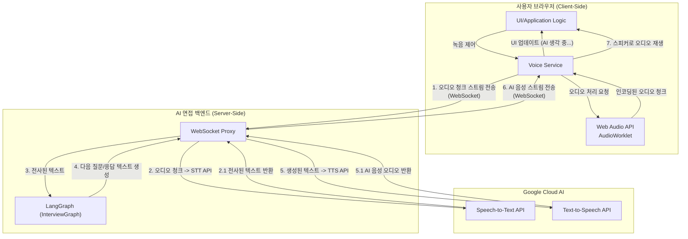

# Gemini Live API와 LangGraph 통합 아키텍처

Gemini Live API를 활용한 실시간 음성 대화 기능을 구현하면서, 동시에 서버 측의 LangGraph 기반 비즈니스 로직(면접 시나리오)을 통합하기 위한 아키텍처입니다.

## 핵심 아키텍처: LangGraph 연동을 위한 서버 프록시

단순히 지연 시간을 줄이기 위해 클라이언트가 Gemini API와 직접 통신하게 되면, AI 면접의 핵심 로직을 담고 있는 서버의 LangGraph를 활용할 수 없습니다. 따라서 이 아키텍처는 백엔드 서버가 클라이언트와 Google Cloud AI 서비스 간의 중개자(Proxy) 역할을 수행하는 모델을 채택합니다.

이를 통해 약간의 지연 시간(latency)이 추가되는 것을 감수하는 대신, 상태 기반의 정교한 면접 시나리오를 구현할 수 있는 완전한 제어권을 확보합니다.

## 데이터 흐름 및 컴포넌트 역할

1.  클라이언트 -> 백엔드 (오디오 전송): 클라이언트의 `Voice Service`는 `AudioWorklet`을 통해 처리된 사용자 음성 오디오 청크를 우리 백엔드 서버의 WebSocket Proxy로 전송합니다.
2.  백엔드 (STT 처리): WebSocket Proxy는 수신한 오디오 스트림을 Google의 Speech-to-Text(STT) API로 전달하여 텍스트로 변환합니다.
3.  백엔드 (LangGraph 실행): 변환된 텍스트(사용자의 답변)는 `InterviewGraph`의 입력으로 전달됩니다. LangGraph는 현재 면접 상태(예: '답변 평가 중')에 따라 적절한 에이전트를 실행합니다.
4.  백엔드 (응답 생성): `InterviewGraph`는 사용자의 답변을 평가하고, 다음 질문이나 피드백 등 AI의 응답 텍스트를 생성하여 WebSocket Proxy에 반환합니다.
5.  백엔드 (TTS 처리): WebSocket Proxy는 LangGraph가 생성한 텍스트를 Google의 Text-to-Speech(TTS) API로 보내 AI의 음성 오디오 파일로 변환합니다.
6.  백엔드 -> 클라이언트 (오디오 응답): 생성된 AI 음성 오디오 스트림을 WebSocket을 통해 클라이언트로 다시 전송합니다.
7.  클라이언트 (재생): 클라이언트는 수신한 AI 음성 스트림을 사용자에게 재생합니다.

## 고려사항

-   지연 시간 관리: 이 아키텍처의 가장 큰 단점은 지연 시간입니다. `클라이언트 -> 백엔드 -> Google -> 백엔드 -> 클라이언트`의 왕복 시간으로 인해 응답이 늦어질 수 있습니다. 이를 완화하기 위해 다음과 같은 전략을 사용해야 합니다.
    -   UI/UX 처리: 사용자가 말을 멈추는 즉시 클라이언트에서 "AI가 생각 중입니다..."와 같은 시각적 피드백을 제공하여 사용자가 인지하는 대기 시간을 줄입니다.
    -   인프라 최적화: 백엔드 서버와 Google Cloud 서비스 간의 네트워크 지연을 최소화할 수 있는 리전(Region)에 서버를 배포합니다.
-   API 비용: STT와 TTS API 호출이 각각 발생하므로 비용 모델을 신중하게 검토해야 합니다.
