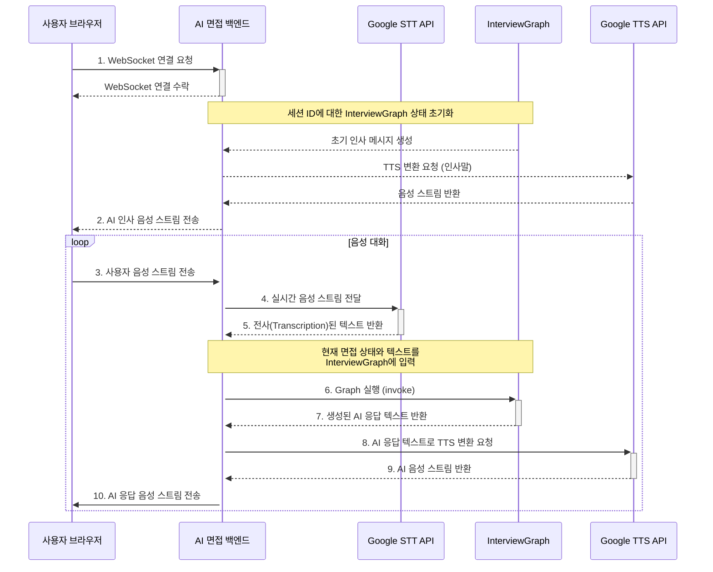

# Gemini Live API와 LangGraph 연동 방안

이 문서는 AI 면접 서비스의 백엔드 서버에서 실시간 음성 스트림을 LangGraph 기반의 면접 시나리오와 연동하는 구체적인 기술 방안을 정의합니다.

## 핵심 연동 흐름

연동의 핵심은 **백엔드 서버가 모든 상호작용을 오케스트레이션(Orchestration)하는 중앙 관제탑 역할**을 수행하는 것입니다. 서버는 클라이언트로부터 받은 음성을 텍스트로 변환하고, 이 텍스트를 LangGraph에 전달하여 비즈니스 로직을 수행한 뒤, 그 결과를 다시 음성으로 변환하여 클라이언트에게 돌려줍니다.

## 단계별 기술 구현 방안

### 1. WebSocket 서버 구축 (`ws` 라이브러리 활용)

-   서버의 진입점(Entrypoint)으로, `server/src/app.ts`에 `ws` 라이브러리를 사용하여 WebSocket 서버를 Express.js HTTP 서버에 연결합니다.
-   `wss.on('connection', ws => { ... })` 이벤트 핸들러 내에서 각 클라이언트와의 연결을 관리합니다.
-   각각의 `ws` 연결은 고유한 면접 세션(`sessionId`)과 매핑되어야 하며, 해당 세션의 LangGraph 상태를 서버 메모리(예: `Map<sessionId, InterviewGraphState>`)에서 관리해야 합니다.

### 2. 음성 스트림 수신 및 STT 처리

-   클라이언트로부터 오디오 청크 (`Buffer`)가 도착하면 (`ws.on('message', ...)`), 서버는 이를 Google Speech-to-Text API의 **스트리밍 인식(Streaming Recognition)** 기능으로 즉시 전달합니다.
-   이를 위해 `@google-cloud/speech` SDK를 사용하며, `streamingRecognize()` 요청을 생성합니다.
-   STT API는 중간 결과(interim results)와 최종 결과(final results)를 스트림 형태로 반환합니다. 사용자의 말이 끝났다고 판단되는 **최종 결과 텍스트**를 확보하는 것이 중요합니다.

### 3. LangGraph 실행 및 응답 생성

-   최종 전사된 텍스트가 확보되면, 해당 `sessionId`에 연결된 `InterviewGraph` 인스턴스를 실행(`invoke`)합니다.
-   **입력**: 현재 대화 상태와 사용자의 답변 텍스트를 `InterviewGraph`의 입력으로 제공합니다.
-   **처리**: `InterviewGraph`는 `evaluateAnswer`, `followupQuestionAgent` 등 현재 상태에 맞는 노드를 실행하여 사용자의 답변을 평가하고, 다음 질문이나 피드백 텍스트를 생성합니다.
-   **출력**: Graph 실행 결과로 생성된 AI의 응답 텍스트를 반환받습니다.

### 4. TTS 처리 및 음성 스트림 전송

-   LangGraph로부터 받은 텍스트 응답을 Google Text-to-Speech API 또는 `@google-cloud/text-to-speech` SDK로 전달합니다.
-   `synthesizeSpeech()` 메서드를 사용하여 텍스트를 오디오 데이터(예: MP3 또는 LINEAR16)로 변환합니다.
-   변환된 오디오 스트림을 연결된 클라이언트 `ws`로 즉시 전송하여, 사용자가 AI의 응답을 들을 수 있도록 합니다.

## 상태 관리의 중요성

-   **세션별 상태 격리**: 다수의 사용자가 동시에 접속하더라도 각 사용자의 면접 내용이 섞이지 않도록, WebSocket 세션 ID를 기준으로 LangGraph의 상태(`state`)를 철저히 격리해야 합니다.
-   **상태 동기화**: `InterviewGraph`의 상태가 변경될 때마다(예: `greeting` -> `technicalQuestion`), 이 변경사항을 서버의 세션 관리 객체에 즉시 저장하여 대화의 연속성을 보장해야 합니다.

