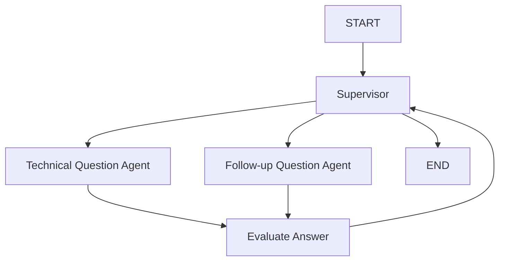

# AI Interview Chatbot - LangGraph Implementation

이 프로젝트는 LangGraph와 **Google Gemini 2.0 Flash**를 사용하여 구현된 AI 기술 면접 챗봇입니다. **Supervisor-Worker 패턴**을 기반으로 한 **3개 에이전트 아키텍처**를 통해 체계적이고 깊이 있는 기술 면접을 제공합니다.

## 🏗️ 아키텍처 개요

### 3개 에이전트 구조

1. **Supervisor Agent**: 면접 흐름을 제어하고 다음 에이전트를 결정하는 오케스트레이터
2. **Technical Question Agent**: 사용자의 기술 스택과 경력에 맞는 기술 질문을 생성
3. **Follow-up Question Agent**: 답변을 심화하기 위한 꼬리질문을 생성

### 워크플로우



## 🚀 빠른 시작

### 1. 환경 설정

```bash
# 의존성 설치
npm install

# 환경 변수 설정
cp .env.example .env
# .env 파일에 Google API 키를 설정하세요
```

**.env 파일 예시:**
```bash
# Google Gemini API Configuration
GOOGLE_API_KEY=your_google_api_key_here

# Optional: LangSmith tracing (for debugging)
# LANGCHAIN_TRACING_V2=true
# LANGCHAIN_API_KEY=your_langsmith_api_key_here
# LANGCHAIN_PROJECT=AI_Interview_Chatbot

# Development settings
NODE_ENV=development
PORT=3000
```

### 2. Google API 키 발급

1. [Google AI Studio](https://makersuite.google.com/app/apikey)에 접속
2. 새 API 키 생성
3. `.env` 파일의 `GOOGLE_API_KEY`에 설정

### 3. 개발 모드 실행

```bash
# TypeScript 개발 서버 시작
npm run dev

# 또는 직접 실행
npx tsx src/index.ts
```

### 4. 프로덕션 빌드

```bash
# TypeScript 컴파일
npm run build

# 컴파일된 JavaScript 실행
npm start
```

## 🔧 사용법

### 기본 사용법

```typescript
import { createInterviewGraph, startInterview, processUserInput } from './src/index.js';

async function runInterview() {
  // 면접 그래프 생성
  const graph = createInterviewGraph();
  
  // 면접 시작
  let state = await startInterview(graph);
  
  // 사용자 입력 처리
  state = await processUserInput(graph, state, "Yes, I'm ready to start!");
  
  // 응답 확인
  const lastMessage = state.messages[state.messages.length - 1];
  console.log("AI Response:", lastMessage.content);
}
```

### 커스텀 설정

```typescript
// 커스텀 페르소나 설정
const customPersona = {
  name: "Dr. Emily Johnson",
  role: "Senior Frontend Developer Interviewer",
  backstory: "10+ years of React and JavaScript expertise",
  style_guidelines: [
    "Focus on practical experience",
    "Ask about real-world problem solving"
  ],
  current_mood: "encouraging"
};

// 커스텀 사용자 프로필
const userProfile = {
  user_id: "user123",
  profile: {
    name: "John Doe",
    experience_level: "senior",
    tech_stack: ["React", "TypeScript", "Node.js"],
    preferred_language: "English"
  }
};

// 커스텀 설정으로 면접 시작
const state = await startInterview(graph, {
  persona: customPersona,
  user_context: userProfile
});
```

## 📁 프로젝트 구조

```
server/
├── src/
│   ├── types/
│   │   └── state.ts          # 상태 타입 정의
│   ├── agents/
│   │   ├── supervisor.ts     # Supervisor 에이전트
│   │   └── workers.ts        # Worker 에이전트들
│   ├── graph/
│   │   └── interviewer.ts    # 메인 그래프 정의
│   └── index.ts              # 진입점
├── package.json
├── tsconfig.json
├── langgraph.json           # LangGraph 설정
├── .env.example             # 환경 변수 예시
└── README.md
```

## 🎯 핵심 기능

### 1. 동적 질문 생성
- 사용자의 기술 스택에 맞춤화된 질문
- 이전 답변 품질에 따른 난이도 조절
- 실무 중심의 실용적 질문

### 2. 지능적 꼬리질문
- 답변의 약점 자동 식별
- 이론과 실무 경험 구분
- 모호한 답변 명확화

### 3. 실시간 평가
- 4가지 기준 기반 체계적 평가
- 구조화된 피드백 제공
- 학습 지향적 접근

### 4. 상태 기반 흐름 제어
- 면접 진행 상황 실시간 추적
- 오류 처리 및 복구 메커니즘
- 확장 가능한 아키텍처

## 🤖 Gemini 2.0 Flash 모델 설정

이 프로젝트는 Google의 최신 Gemini 2.0 Flash 모델을 사용합니다:

```typescript
// 기본 설정
const model = new ChatGoogleGenerativeAI({
  model: "gemini-2.0-flash",
  temperature: 0.7,
  apiKey: process.env.GOOGLE_API_KEY,
});

// 평가용 (더 정확한 결과를 위해 temperature 0)
const evaluationModel = new ChatGoogleGenerativeAI({
  model: "gemini-2.0-flash",
  temperature: 0,
  apiKey: process.env.GOOGLE_API_KEY,
}).withStructuredOutput(EvaluationResultSchema);
```

### Gemini 2.0 Flash의 장점
- **향상된 추론 능력**: 더 정확한 기술 질문 생성 및 평가
- **빠른 응답 속도**: 실시간 면접 진행에 최적화
- **한국어 지원 개선**: 자연스러운 한국어 면접 진행
- **구조화된 출력**: JSON 스키마 기반 정확한 데이터 생성

## 🛠️ 개발 도구

### LangGraph Studio 사용

LangGraph Studio를 사용하여 그래프를 시각화하고 디버깅할 수 있습니다.

```bash
# LangGraph Studio 시작 (Docker 필요)
langgraph dev

# 브라우저에서 http://localhost:8123 접속
```

### macOS에서 LangGraph Studio CLI 다운로드

```bash
# Apple Silicon Mac용
curl -L https://github.com/langchain-ai/langgraph-studio/releases/latest/download/langgraph-studio-macos-arm64.tar.gz | tar -xz -C /usr/local/bin

# Intel Mac용  
curl -L https://github.com/langchain-ai/langgraph-studio/releases/latest/download/langgraph-studio-macos-x64.tar.gz | tar -xz -C /usr/local/bin

# 실행 권한 부여
chmod +x /usr/local/bin/langgraph-studio
```

## 📊 평가 기준

면접 답변은 다음 4가지 기준으로 평가됩니다:

1. **문제 이해도** (1-5점)
2. **정확성 및 기술적 깊이** (1-5점)
3. **명확성 및 의사소통** (1-5점)
4. **구체적인 근거 및 예시** (1-5점)

## 🔄 상태 관리

시스템은 다음 상태를 관리합니다:

- **사용자 컨텍스트**: 프로필, 기술 스택
- **페르소나**: 면접관 정체성
- **태스크**: 질문 풀, 현재 질문, 답변
- **평가**: 점수, 피드백, 진행률
- **흐름 제어**: 다음 에이전트 결정
- **가드레일**: 안전성, 오류 처리

## 🚨 문제 해결

### 일반적인 오류

1. **Google API 키 오류**
   ```bash
   export GOOGLE_API_KEY="your-google-api-key-here"
   ```

2. **모듈 import 오류**
   ```bash
   npm install
   npm run build
   ```

3. **TypeScript 컴파일 오류**
   ```bash
   npx tsc --noEmit  # 타입 체크만 수행
   ```

4. **Gemini API 할당량 초과**
   - [Google AI Studio](https://makersuite.google.com/app/apikey)에서 사용량 확인
   - 필요시 유료 플랜으로 업그레이드

### 디버깅

```typescript
// 상태 디버깅
console.log("Current state:", JSON.stringify(state, null, 2));

// 에이전트 실행 로그
console.log("🎯 Supervisor decision:", result.next);
console.log("🔧 Technical question:", result.content);
```

## 🎨 커스터마이징

### 새로운 질문 추가

```typescript
// state.ts에서 question_pool 확장
{
  id: "new_question",
  text: "Your new technical question",
  category: "Category",
  difficulty: "medium",
  expected_topics: ["topic1", "topic2"]
}
```

### 새로운 에이전트 추가

1. `agents/workers.ts`에 새 에이전트 함수 추가
2. `graph/interviewer.ts`에서 그래프에 노드 추가
3. `agents/supervisor.ts`에서 라우팅 로직 업데이트

### Gemini 모델 변경

```typescript
// 다른 Gemini 모델 사용
const model = new ChatGoogleGenerativeAI({
  model: "gemini-1.5-pro",  // 또는 "gemini-1.0-pro"
  temperature: 0.7,
  apiKey: process.env.GOOGLE_API_KEY,
});
```

## 📚 참고 문서

- [LangGraph Documentation](https://langchain-ai.github.io/langgraph/)
- [LangChain.js Documentation](https://js.langchain.com/)
- [Google Gemini API Documentation](https://ai.google.dev/docs)
- [Google AI Studio](https://makersuite.google.com/)

## 🤝 기여

1. Fork the repository
2. Create your feature branch (`git checkout -b feature/amazing-feature`)
3. Commit your changes (`git commit -m 'Add some amazing feature'`)
4. Push to the branch (`git push origin feature/amazing-feature`)
5. Open a Pull Request

## 📄 라이선스

이 프로젝트는 MIT 라이선스 하에 배포됩니다. 자세한 내용은 `LICENSE` 파일을 참조하세요. 